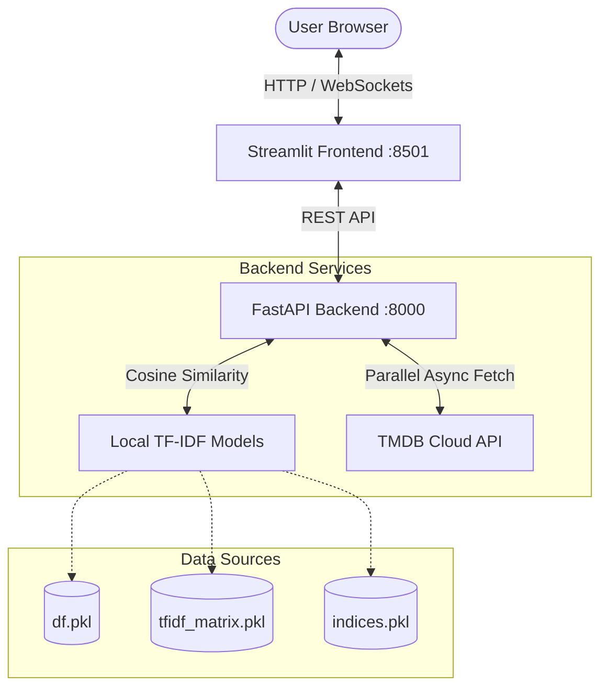

# 🎬 Movie Recommendation System


A modern, high-performance, and resilient **hybrid movie recommendation web application** featuring a **FastAPI** backend and an interactive **Streamlit** frontend interface.

The system provides dual-mode recommendations: **content-based filtering (TF-IDF)** on a local dataset of 45,000+ movies, and **live genre-based discovery** via the TMDB API.

---

## ✨ Key Features

* **⚡ Hybrid Recommendation Engine**:
  * **TF-IDF & Cosine Similarity**: Recommends similar movies using natural language features (overview, genres, taglines, keywords) computed on a local 45k Kaggle dataset.
  * **Dynamic Genre Discovery**: Live suggestions using real-time TMDB API lookups based on genre classification.
* **🛡️ ISP & Connection Resilience (Self-Healing)**:
  * Employs a custom thread-pooled synchronous requests transport layer with **10-attempt exponential backoff retries** to bypass regional ISP Deep Packet Inspection (DPI) blocks and Windows Proactor DNS resolution bottlenecks.
* **💅 Modern UI/UX**:
  * Responsive, glassmorphic card grids, clean movie detail views, and real-time search suggestions built with Streamlit.
* **🚀 Concurrent API Processing**:
  * Backend uses `asyncio.gather` to retrieve recommendation metadata and posters in parallel, reducing page load times from ~10s to <1s.

---

## 🛠️ Technology Stack

<p align="left">
  
  
  
  
  
  
</p>

---

## 📐 System Architecture



---

## 🔧 Installation & Setup

### 📋 Prerequisites
* Python 3.10+ (Tested on Python 3.13)
* A TMDB API Key (Get one free from [TheMovieDB](https://www.themoviedb.org/documentation/api))

### 1️⃣ Clone the Repository
```bash
git clone https://github.com/KhannakPGupta/Movie-Recommendation-System.git
cd Movie-Recommendation-System
```

### 2️⃣ Environment Configuration
Create a `.env` file in the root folder of the project:
```env
TMDB_API_KEY=your_tmdb_api_key_here
```

### 3️⃣ Install Dependencies
Set up a virtual environment and install the required packages:
```bash
python -m venv .venv
# On Windows
.venv\Scripts\activate
# On macOS/Linux
source .venv/bin/activate

pip install -r requirements.txt
```

### 4️⃣ Running the Application

Start the **FastAPI backend** server first:
```bash
uvicorn main:app --reload --port 8000
```

In a separate terminal, start the **Streamlit frontend**:
```bash
streamlit run app.py
```

Open your browser to `http://localhost:8501` to start exploring recommendations!

---

## 🧠 Model & Dataset Details

The content-based recommender uses the classic **Kaggle Movies Metadata Dataset** containing movies up to late 2017:
* **TF-IDF Vectorizer**: Fits on a combined text document of movie overviews, genres, taglines, and keyword tags.
* **Model Serialization**:
  * `df.pkl`: Cleaned dataframe of metadata.
  * `tfidf_matrix.pkl`: Pre-computed sparse matrix representation of movie text vectors.
  * `indices.pkl`: Mapping series between movie titles and matrix row indices.

> [!NOTE]
> For movies released after 2017 (e.g., *The Batman (2022)*), the application dynamically displays genre recommendations from the TMDB Cloud API.